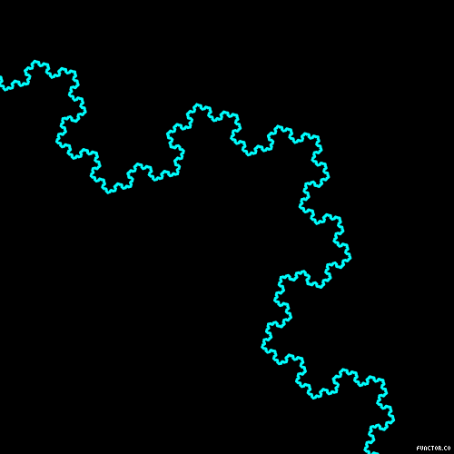

# Fractals

Fractals are infinitely complex patterns that are self-similar across different scales. The pattern remains the same the more you zoom into a section of it.
An example taken from [here.](https://imgur.com/gallery/NIRi3cb)

Using recursion I have implement two famous fractals
- Koch Snowflake
- Sierpiński triangle

This was done using python and the turtle graphics library.
